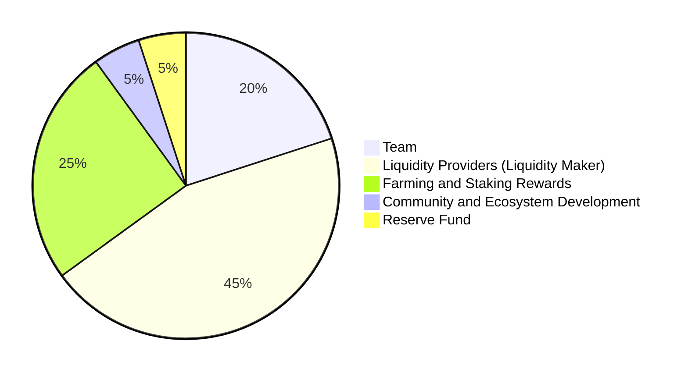

### Token Distribution

The Cookie Token (CKS) distribution is strategically designed to ensure the long-term sustainability and equitable growth of the CookieSwap ecosystem. Our distribution model is focused on fair allocation, incentivizing various stakeholders while maintaining a decentralized governance structure.

#### Distribution Breakdown:

- **Team**: 20%
  - Allocated to the founding team and core developers.
  - Initial Unlock: 2% at launch to incentivize immediate development and operational needs.
  - Lock-in Period: Remaining tokens locked for 1 year post-launch to align with the platform's long-term objectives.
  - Gradual Release: Post-lock-in, tokens are released evenly over the next 2 years, ensuring ongoing commitment and development alignment.

- **Liquidity Providers (Liquidity Maker)**: 45%
  - **Mechanics**:
    - **User Contribution**: Liquidity providers contribute by adding WETH to the liquidity pools. The LiquidityMaker contract matches these contributions with an equivalent value of Cookie tokens, enhancing the pool's liquidity.
    - **Lock-in Rewards**: A locking mechanism is implemented to promote stability in the liquidity pools. Tokens are locked for a predetermined period, typically one year.
    - **Redemption of LP Tokens**: Post lock-in, providers can redeem their pool share as LP tokens, representing ownership of both Cookie and WETH.
    - **Slippage Control**: Providers can set slippage tolerance when contributing to mitigate unfavorable price movements.
  - **Benefits**: Liquidity providers play a crucial role in platform stability and are rewarded with CKS tokens, granting them governance rights and other potential rewards.

- **Farming and Staking Rewards**: 25%
  - Allocated to users engaged in yield farming and staking, with rewards based on staking amount and duration.

- **Community and Ecosystem Development**: 5%
  - Dedicated to marketing, community building, educational initiatives, and collaborations, essential for organic growth.

- **Reserve Fund**: 5%
  - Set aside as a reserve for unforeseen circumstances or future opportunities, ensuring the platform's adaptability and financial resilience.

#### Governance and Decentralization:

- CKS token holders participate in governance, contributing to key decision-making and protocol changes.
- The model promotes a decentralized, community-driven approach with a focus on long-term platform resilience.

### Future-Proofing the Ecosystem

- A portion of transaction fees is reinvested into the treasury, ensuring sustainable development funding.
- Regular updates and transparent governance processes maintain decentralization and community trust.
- A dispute resolution mechanism is in place to address governance conflicts, ensuring smooth operations.

CookieSwap commits to a balanced token economy, aligning stakeholder interests and advancing towards a decentralized future.
